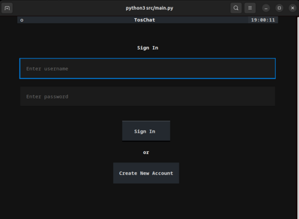
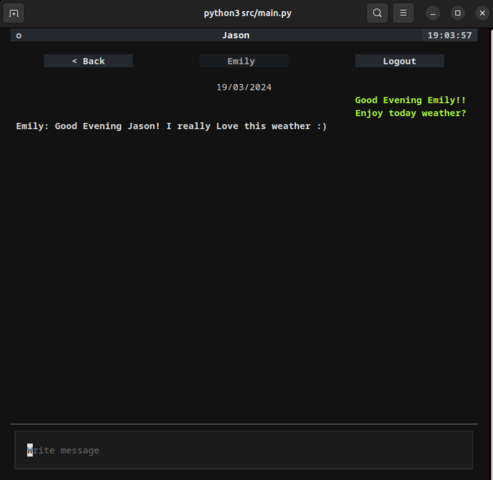

## Chat with your friends within your terminal (Linux & Mac)

Sign In             |  Let Chat!
:-------------------------:|:-------------------------:
   |  

## Note
on Linux, if you're using Ubuntu or Debain terminal will be resize automatically when app starts. 

on MacOs, terminal will be resize automatically when app starts if you're using
iTerm, iTerm2 or Terminal.

For better experience change font size to 10 or 11

## Installation
```bash
curl -sSL https://raw.githubusercontent.com/MuongKimhong/toschat/master/install.sh | bash
```
### Usage
use `toschat` command to open the application
```bash
toschat
```
to quit the application presse `Ctrl+c` or use icoo at left of the header

All data are stored in live server!
